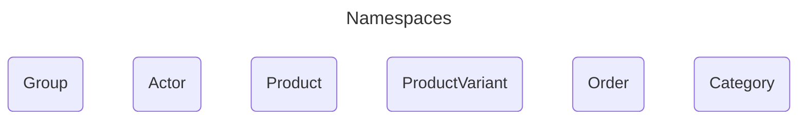
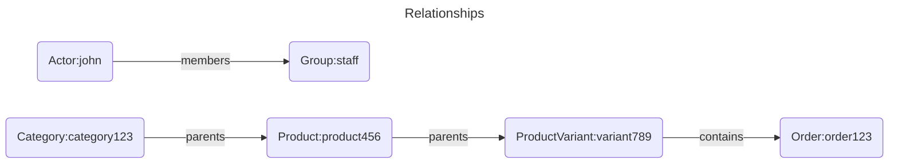
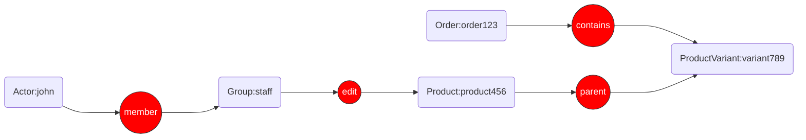

# Permission Models in Ory Keto

In the dynamic and complex world of e-commerce, a robust and flexible authorization model is paramount. Traditional Role-Based 
Access Control (RBAC) often falls short in handling the intricate relationships between users, products, orders, and stores. 
This is where Relationship-Based Access Control (ReBAC) shines, and Ory Keto, an open-source implementation of Google's Zanzibar, 
provides a powerful and scalable solution. 

## Defining the Core Namespaces for the ReBAC Model

At its core, ReBAC determines access rights based on the relationships between entities. Instead of assigning static 
roles with predefined permissions, ReBAC allows for a more granular and context-aware authorization system. 
In an e-commerce context, this means you can define permissions based on natural relationships like:

- A **customer** owns an **order**.
- A **customer** is a member of a **loyalty program**.
- A **merchant** manages a **product**.
- A store **administrator** has administrative access to a **storefront**.

We define the following namespaces for the different entities in the system. A good starting point for our platform would be:

- **Actor**: Represents staff, customers, and bots.
- **Product**: Represents products in the catalog.
  - `parent`: The category a product belongs to. Viewers and editors of the category can view and edit the product.
  - `editors`: Actors or groups that can view or edit the product.
  - `viewers`: Actors or groups that can view the product.
- **ProductVariant**: Represents different variants of a product (e.g., size, color).
  - `parent`: The product a variant belongs to. Viewers and editors of the product can view and edit the variant.
  - `editors`: Actors or groups that can view or edit the product variant.
  - `viewers`: Actors or groups that can view the product variant.
- **Order**: Represents customer orders.
  - `owner`: The actor who owns the order.
  - `contains`: The variants contained in the order.
- **Category**: Represents the category taxonomy.
  - `parent`: The parent category. Viewers and editors of the parent category can view and edit the child category.
  - `editors`: Actors or groups that can view or edit the category.
  - `viewers`: Actors or groups that can view the category.
- **Group**: Represents groups of actors, such as "admins", "customers", "staff", "bots" etc.
  - `members`: Actors or other groups that are members of this group.

## Crafting Relation Tuples for Common Scenarios

With the namespaces defined, the following relation tuples will represent the relationships within the platform.

### User Roles and Permissions:

- **Basic User Roles**:

  - `Group:staff#members@Actor:john` (Actor:john is in members of Group:staff)
  - `Product:product456#editors@Group:staff` (members of Group:staff are editors of Product:product456)
  - `Group:admins#members@Group:inventory` (Group:inventory is in members of Group:admins)

### Product Management:

- A merchant can manage products in their store:
  - This is an indirect relationship. The permission to manage a product is derived from the ownership of the category the product belongs to. 
    We'll define this logic in the OPL.
  - First, establish the product-category relationship: `Product:product456#parents@Category:category123` (Category:category123 is a parent of Product:product456)

- Managing Product Variants:
  - `ProductVariant:variant789#parents@Product:product456` (Product:product456 is a parent of ProductVariant:variant789)
  - Permissions on the parent product can then be inherited by the variant.

### Order Management:

- A customer owns their order:
  - `Order:order123#owners@Actor:jane` (Actor:jane is an owner of Order:order123)
  
- A merchant can view orders for their products:

  - This requires linking an order to a product variant and then to the merchant.
  - `Product:product456#editors@Group:staff` (members of Group:staff can edit Product:product456)
  - `Group:staff#members@Actor:john` (Actor:john is in members of Group:staff)
  - `ProductVariant:variant789#parents@Product:product456` (Product:product456 is a parent of ProductVariant:variant789)
  - `Order:order123#contains@ProductVariant:variant789` (Order:order123 contains ProductVariant:variant789)

## Relationship Graph
