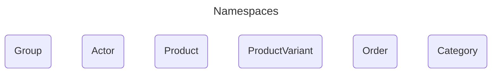
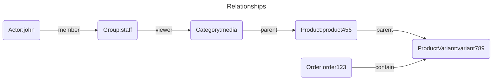
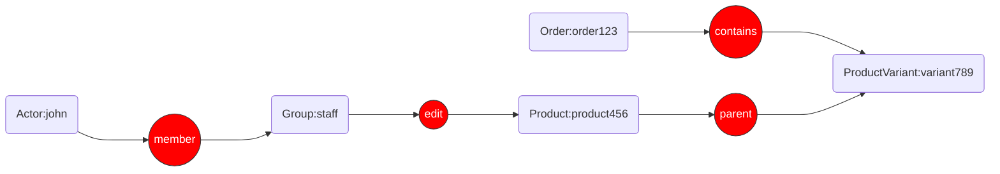

# Permission Models in Ory Keto

In the dynamic and complex world of e-commerce, a robust and flexible authorization model is paramount. Traditional Role-Based 
Access Control (RBAC) often falls short in handling the intricate relationships between users, products, orders, and stores. 
This is where Relationship-Based Access Control (ReBAC) shines, and Ory Keto, an open-source implementation of Google's Zanzibar, 
provides a powerful and scalable solution. 

## Defining the Core Namespaces for the ReBAC Model

At its core, ReBAC determines access rights based on the relationships between entities. Instead of assigning static 
roles with predefined permissions, ReBAC allows for a more granular and context-aware authorization system. 
In an e-commerce context, this means you can define permissions based on natural relationships like:

- A **customer** owns an **order**.
- A **customer** is a member of a **loyalty program**.
- A **merchant** manages a **product**.
- A store **administrator** has administrative access to a **storefront**.

We define the following namespaces and relations for the different entities in the system. A good starting point for our platform would be:

- **Actor**: Represents users (staff, customers) and bots.
- **Product**: Represents products in the catalog.
  - `parent`: The category a product belongs to. Viewers and editors of the category can view and edit the product.
  - `editor`: Actors or groups that can view or edit the product.
  - `viewer`: Actors or groups that can view the product.
  - `owner`: The actor who owns the product (usually the actor who created the product).
- **ProductVariant**: Represents different variants of a product (e.g., size, color).
  - `parent`: The product a variant belongs to. Viewers and editors of the product can view and edit the variant.
  - `editor`: Actors or groups that can view or edit the product variant.
  - `viewer`: Actors or groups that can view the product variant.
- **Order**: Represents customer orders.
  - `owner`: The actor who owns the order.
  - `contain`: The variants contained in the order.
- **Category**: Represents the category taxonomy.
  - `parent`: The parent category. Viewers and editors of the parent category can view and edit the child category.
  - `editor`: Actors or groups that can view or edit the category.
  - `viewer`: Actors or groups that can view the category.
- **Group**: Represents groups of actors, such as "admins", "customers", "staff", "bots" etc.
  - `member`: Actors or other groups that are members of this group.

## Actor Types

There are two broad categories of actors in this model:

- **Human Actors**: These are individual users such as customers, merchants, and administrators. They can be assigned to groups for easier management of permissions.
- **Service Actors (Bots)**: These are non-human entities like bots or services that perform automated tasks. They can also be assigned to groups and have specific permissions based on their roles.

## Crafting Relation Tuples for Common Scenarios

With the namespaces defined, the following relation tuples will represent the relationships within the platform.

### Category Permissions:

- **view**:
  The permission to view a category can be granted to specific actors or via group membership.
  Child and descendant categories inherit viewers from their parent categories.

  - `Group:staff#members@Actor:john` (Actor:john is in members of Group:staff)
  - `Category:media/videos#parents@Category:media` (Category:media is in parents of Category:media/videos)
  - `Category:media#viewers@(Group:staff#members)` (members of Group:staff are viewers of Category:media). 
     Group members (i.e. john) can view `media` Category and all its children, including media/videos via an indirect relationship.
  - `Category:media#viewers@agnes` (Subject agnes is in viewers of Category:media). 
     Agnes can view `media` Category and all its children, including media/videos via a direct relationship.
- **edit**:
  The permission to edit a category can be granted to specific actors or via group membership.
  Child and descendant categories inherit editors from their parent categories. Editors can also view the categories they can edit.

  - `Category:media#editors@(Group:admin#members)` (members of Group:admin are editors of Category:media). 
    Group members can edit `media` Category and all its children, including media/videos via an indirect relationship.
  - `Category:media#editors@becky` (Subject becky is in editors of Category:media). 
    Becky can edit `media` Category and all its children, including media/videos via a direct relationship.

### Product Permissions:

- **view**:
  The permission to view a product can be granted to specific actors or via group membership.
  Products inherit viewers from their parent categories.

  - `Group:staff#members@Actor:john` (Actor:john is in members of Group:staff)
  - `Product:the-matrix#viewers@(Group:staff#members)` (members of Group:staff are viewers of Product:the-matrix). 
    Group members (i.e. john) can view `the-matrix` and all its variants via an indirect relationship.
  - `Product:lotr#viewers@agnes` (Subject agnes is in viewers of Product:lotr). 
    Agnes can view `lotr` and all its variants via a direct relationship.
- **edit**:
  The permission to edit a product can be granted to specific actors or via group membership.
  Products inherit editors from their parent categories.

  - `Group:support#members@Actor:becky` (Actor:becky is in members of Group:support)
  - `Product:the-matrix#editors@(Group:support#members)` (members of Group:support are editors of Product:the-matrix). 
    Group members (i.e. john) can edit `the-matrix` and all its variants via an indirect relationship.
  - `Product:lotr#editors@isaac` (Subject isaac is in editors of Product:lotr). 
    Isaac can edit `lotr` and all its variants via a direct relationship.
  
- **delete**:
  The permission to delete a product can be granted to specific actors or via group membership.
  Only the owner of the product can delete it.

  - `Product:the-matrix#owner@Actor:john` (Actor:john is the owner of Product:the-matrix). 
    John can delete `the-matrix` and its variants.
  - `Product:lotr#owner@becky` (Subject becky is the owner of Product:lotr). 
    Becky can delete `lotr` but not its variants.

### Order Permissions:

_TODO_
- A customer owns their order:
  - `Order:order123#owners@Actor:jane` (Actor:jane is an owner of Order:order123)
  
- A merchant can view orders for their products:

  - This requires linking an order to a product variant and then to the merchant.
  - `Product:product456#editors@Group:staff` (members of Group:staff can edit Product:product456)
  - `Group:staff#members@Actor:john` (Actor:john is in members of Group:staff)
  - `ProductVariant:variant789#parents@Product:product456` (Product:product456 is a parent of ProductVariant:variant789)
  - `Order:order123#contains@ProductVariant:variant789` (Order:order123 contains ProductVariant:variant789)

## Relationship Graph

_TODO_
